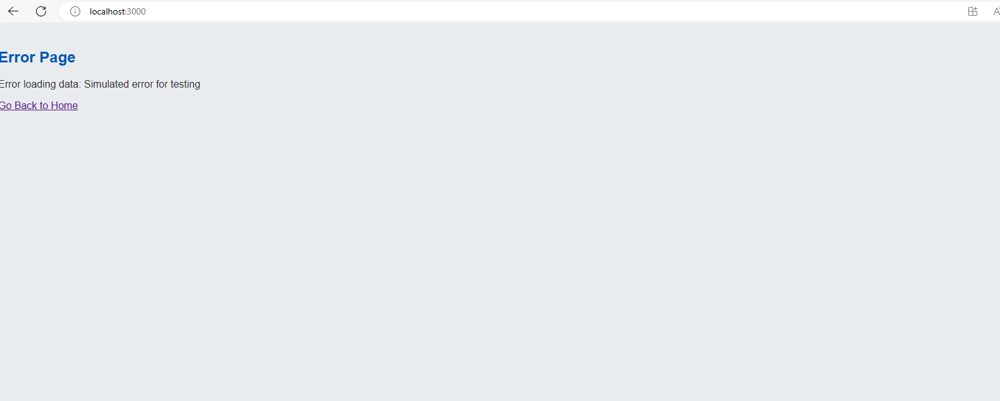
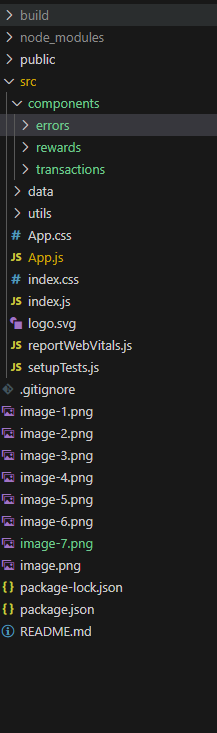
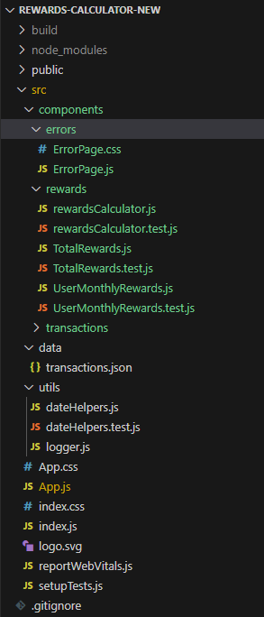
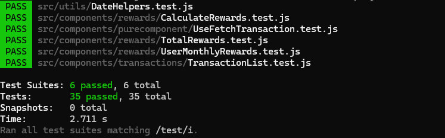

# Rewards Program Application

This project is a React application that displays user transactions and calculates reward points based on purchase amounts. It includes multiple components to show transactions, user monthly rewards, and total rewards for each customer.

## Features

- **Transaction Table:** Displays a list of user transactions.
- **User Monthly Rewards:** Shows reward points earned by each user for each month.
- **Total Rewards:** Aggregates and displays total reward points for each customer.
- **Routing:** Uses `react-router-dom` to navigate between different views.

## Technologies Used

- React
- React Router
- React Testing Library
- Jest
- loglevel

## Installation and Setup

Ensure you have Node.js installed on your machine. You can download it from [nodejs.org](https://nodejs.org/).

Clone the repository to your local machine using:

git clone https://github.com/rammanohar0725/rewards-calculator-new 
cd rewards-calculator-new

## Install Dependencies

npm install

## Running Tests

npx jest test

## Application Starting

npm start

## Screen Shots

## ERROR Response

## folder structure

## Expandable Folder Strcture

## Proof screenshot: 35 test cases executed successfully

## Note:
If you want to see the error page rename to App.erro.js to App.js. and App.js to make App.back.js

## Test Cases Explanation

##########################################################################################################################################################

Test Case Document for TotalRewards Component
Component: TotalRewards
Purpose:
The TotalRewards component displays a table of customers and their respective total reward points based on the provided transaction data. It logs transaction processing and handles errors during reward calculations.

Test Cases
1. Rendering Table Headers
Test Case ID: TR01
Description: Verify that the component renders the table headers correctly.
Preconditions: The TotalRewards component is rendered with a valid transactions array.
Test Steps:
Render the TotalRewards component.
Check if the table headers "Customer Name" and "Reward Points" are present in the document.
Expected Result: The table headers "Customer Name" and "Reward Points" should be displayed.

2. Calculating and Displaying Total Rewards
Test Case ID: TR02
Description: Verify that the component calculates and displays total rewards for each customer correctly.
Preconditions: The TotalRewards component is rendered with a valid transactions array.
Test Steps:
Render the TotalRewards component.
Verify that each customer's name and their calculated reward points are displayed correctly.
Expected Result: The component should display "Amit" with 2250 reward points and "Emily" with 1350 reward points.

3. Logging Transactions and Reward Processing
Test Case ID: TR03
Description: Verify that the component logs the processing of transactions and the calculation of total rewards.
Preconditions: The TotalRewards component is rendered with a valid transactions array.
Test Steps:
Render the TotalRewards component.
Check that the logger has been called with appropriate debug messages, including the transaction data and calculated rewards.
Expected Result: Logger should output debug messages indicating the processing of each transaction and the calculation of total rewards.

4. Handling Errors During Reward Calculation
Test Case ID: TR04
Description: Verify that the component handles exceptions during reward calculation and displays an error message.
Preconditions: The calculateRewards function is mocked to throw an error for testing purposes.
Test Steps:
Render the TotalRewards component with the calculateRewards function mocked to throw an error.
Verify that an error message is displayed in the component.
Check that the logger has logged the error message.
Expected Result: The component should display an error message "Error calculating total rewards. Please try again later." and log the error.

##########################################################################################################################################################

Test Case Document for TransactionTable Component
Component: TransactionTable
Purpose:
The TransactionTable component is responsible for displaying transaction data in a tabular format, including transaction details, customer information, and reward points.

Test Cases
1. Rendering Table Headers
Test Case ID: TT01
Description: Verify that the table headers are rendered correctly.
Preconditions: The TransactionTable component is rendered with a valid transactions array.
Test Steps:
Render the TransactionTable component.
Verify that the following table headers are present in the document:
"Transaction ID"
"Customer ID"
"Customer Name"
"Purchase Date"
"Month"
"Product Purchased"
"Price"
"Reward Points"
Expected Result: All specified table headers should be displayed in the document.

2. Rendering Transaction Data
Test Case ID: TT02
Description: Verify that the transaction data is rendered correctly for each transaction.
Preconditions: The TransactionTable component is rendered with a valid transactions array.
Test Steps:
Render the TransactionTable component.
Use screen.debug() to print the DOM structure (optional, for debugging purposes).
Verify the following transaction details are displayed:
Transaction ID: "t001"
Customer Name: "Amit"
Product Purchased: "Laptop"
Price: "$1200.00"
Reward Points: "2250"
Transaction ID: "t002"
Customer Name: "Emily"
Product Purchased: "Smartphone"
Price: "$800.00"
Reward Points: "1350"
Verify the month names ("December" and "January") are rendered if uncommented.
Expected Result: All specified transaction details should be displayed for each transaction.

##########################################################################################################################################################

Test Case Document for UserMonthlyRewards Component
Component: UserMonthlyRewards
Purpose:
The UserMonthlyRewards component aggregates and displays the monthly reward points for each customer based on their transaction data. It logs the processing of transactions and handles errors during reward calculations.

Test Cases
1. Rendering Table Headers
Test Case ID: UMR01
Description: Verify that the table headers are rendered correctly.
Preconditions: The UserMonthlyRewards component is rendered with a valid transactions array.
Test Steps:
Render the UserMonthlyRewards component.
Verify that the following table headers are present in the document:
"Customer ID"
"Name"
"Month"
"Year"
"Reward Points"
Expected Result: All specified table headers should be displayed in the document.

2. Aggregating and Displaying Monthly Rewards
Test Case ID: UMR02
Description: Verify that the component aggregates and displays monthly rewards for each customer correctly.
Preconditions: The UserMonthlyRewards component is rendered with a valid transactions array.
Test Steps:
Render the UserMonthlyRewards component.
Use screen.debug() to print the DOM structure (optional, for debugging purposes).
Verify the following details for each customer:
For "Amit" (Customer ID: "c001"):
Month: "December"
Year: "2023"
Reward Points: "2250"
For "Emily" (Customer ID: "c002"):
Month: "January"
Year: "2024"
Reward Points: "1350"
Expected Result: The component should display the correct monthly rewards for each customer.

3. Calling Utility Functions with Correct Arguments
Test Case ID: UMR03
Description: Verify that the utility functions calculateRewards, getMonthName, and getYear are called with correct arguments.
Preconditions: The UserMonthlyRewards component is rendered with a valid transactions array.
Test Steps:
Render the UserMonthlyRewards component.
Verify that calculateRewards is called with each transaction's price.
Verify that getMonthName and getYear are called with each transaction's purchase date.
Expected Result: The utility functions should be called with the correct arguments as per the transaction data.

4. Logging Transactions and Rewards Processing
Test Case ID: UMR04
Description: Verify that the component logs the processing of transactions and the calculation of monthly rewards.
Preconditions: The UserMonthlyRewards component is rendered with a valid transactions array.
Test Steps:
Render the UserMonthlyRewards component.
Check that the logger outputs debug messages for receiving transaction data and processing each transaction.
Expected Result: Logger should output debug messages indicating the processing of each transaction and the calculation of monthly rewards.

5. Handling Errors During Reward Calculation
Test Case ID: UMR05
Description: Verify that the component handles exceptions during reward calculation and displays an error message.
Preconditions: The calculateRewards function is mocked to throw an error for testing purposes.
Test Steps:
Render the UserMonthlyRewards component with the calculateRewards function mocked to throw an error.
Verify that an error message is displayed in the component.
Check that the logger has logged the error message.
Expected Result: The component should display an error message "Error calculating user monthly rewards. Please try again later." and log the error.

## Based on my observations, there are opportunities for improvement in this project

1. Code Quality and Structure
Modularization
Current State: Ensure that the code is modular and follows the Single Responsibility Principle (SRP).
Improvement: Break down large components and functions into smaller, reusable pieces. This makes the code easier to read, test, and maintain.
Consistent Naming Conventions
Current State: Evaluate the presence and quality of comments and documentation within the code.
Improvement: Add meaningful comments and documentation to explain complex logic and the purpose of various modules. Use JSDoc for function and method documentation.

2. Testing
Test Coverage
Current State: Review the current test coverage for components, hooks, and utilities.
Improvement: Aim for high test coverage, including unit tests, integration tests, and end-to-end tests. Use tools like Jest and React Testing Library for testing React components.
Mocking and Stubbing
Current State: Evaluate the use of mocks and stubs in tests.
Improvement: Ensure that external dependencies (e.g., API calls) are properly mocked to isolate tests and make them reliable.

3. Performance and Optimization
Code Optimization
Current State: Analyze the performance of key components and functions.
Improvement: Optimize code for performance, such as reducing unnecessary re-renders in React components, using memoization, and optimizing loops and data structures.
Bundle Size

4. Security
Vulnerability Scanning
Current State: Assess the use of tools for scanning vulnerabilities in dependencies.
Improvement: Regularly run vulnerability scans using tools like npm audit or Snyk and address any identified issues promptly.
Secure Coding Practices
Current State: Evaluate the code for common security issues (e.g., XSS, SQL injection).
Improvement: Follow secure coding practices, such as input validation, sanitization, and using prepared statements for database queries.
